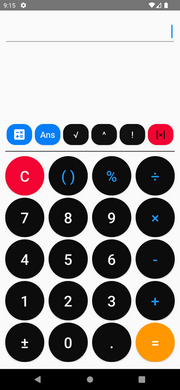
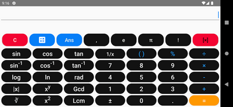

# Scientific calculator application

>Scientific calculator application for Android phones with functions: calculation with operators; scientific calculation (square root calculation; cube root calculation; factorial calculation; exponentiation calculation; trigonometry; ...)

## Portrait UI

>Portrait UI have some functions such as calculation with operators (summation, subtraction, multiplication, division); square root operation; exponentiation; factorial. Besides, there are additional buttons to clear and convert to landscape UI.

## Landscape UI

>Landscape UI have functions of portrait UI. Besides, there are additional some different functions such as trigonometric; logarit; calculate absolute value; calculate with π or e; find the greatest common divisor; find the least common multiple;...etc

